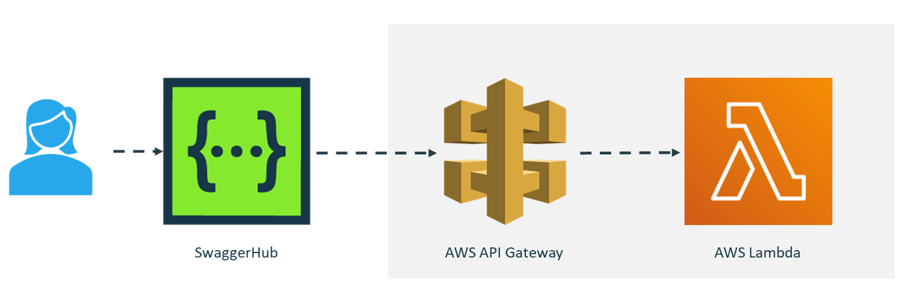

# SwaggerHub-AWSGateway-Lambda
A sample solution taking an API definition from SwaggerHub, crafting a Lambda function from the API definition, and then publishing the function behind AWS Gateway.

   README could be structured like:
   
   [Problem Statement] Many customers want to be able to…
   
   [Solution Overview] With Amazon API Gateway and SwaggerHub customers can…
   
   [Prerequisites] To follow this sample, you must have the following software installed:

   
   [Instructions] In order to […], take the following steps:
   

## Problem Statement
 ToDo
## Solution Overview
ToDo
## Prerequisites

You will need an AWS subscription and a SwaggerHub account in order to be able to work on the API design, AWS Lambda implementation, and automated deployment to AWS API Gateway.

1. Sign up for an [AWS account](https://aws.amazon.com/free/) (if required)
2. Sign up for a [SwaggerHub trial](https://try.smartbear.com/swaggerhub?utm_medium=product&utm_source=GitHub&utm_campaign=devrel-marketplaces-api&utm_content=code-samples) account (if required)
3. Sign up for a [GitHub account](https://github.com/join) (if required)

The sample Lambda function generated within this repo uses `dotnet6`. If you would like to edit the code implementation, then the following are required:
- [VS Code](https://code.visualstudio.com/download) (or similar IDE)
- Install [.NET 6.0](https://dotnet.microsoft.com/en-us/download/dotnet/6.0)
- Install Amazon Lambda Tools
  - `dotnet tool install -g Amazon.Lambda.Tools`
- Install [SAM CLI](https://docs.aws.amazon.com/serverless-application-model/latest/developerguide/install-sam-cli.html) (AWS Serverless Application Model Command Line Interface)

## Instructions

### Fork the repo
- Fork the repo to your local GitHub profile/organization

### Import the _Book API_ to SwaggerHub
- Login into SwaggerHub
- From the **Create New** menu select **Import and Document API**
- Enter the following URL in the Browse input box
  - `https://raw.githubusercontent.com/SmartBear-DevRel/SwaggerHub-AWSGateway-Lambda/main/API-Definition/openapi.yaml`
- Press the **Import** button
- In the next pop-up window press the **Import Definition** button

### IAM Role Setup for Deployment
- Follow the [IAM and Resource Setup Guide](./IAM_DEPLOYMENT_ROLES.md) to ensure you can run the pipeline

### Run GitHub Action to deploy _AWS API Gateway_ and _AWS Lambda Function_
- In your forked GitHub repository, navigate to the _Actions_ tab
- Click on the `Pipeline` action on the left-hand pane
- Run the `Pipeline` workflow by clicking on the **Run workflow** button

### Update the SwaggerHub Books API with the _AWS API Gateway_ endpoint
- In the SwaggerHub Portal page, click on `Books API` to open the API definition
- ToDO - INSTRUCTIONS FOR GETTING ENDPOINT
- Locate the `servers` tag, and replace the `url` for the `AWS API Gateway Endpoint` server tag with the value of the value from above
- Click the **Save** button

### Calling your _AWS API Gateway_ Books API from SwaggerHub
- In the SwaggerHub Portal page, click on `Books API` to open the API definition
- In the _SwaggerUI_ pane (the right-hand pane), choose the _AWS API Gateway Endpoint_ from the **Servers** dropdown
- Expand `GET /books`, click the **Try it out** button
- Optionally, enter an `title` or `author` query parameter
- Click **Execute**

