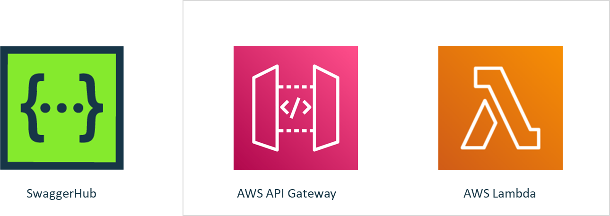
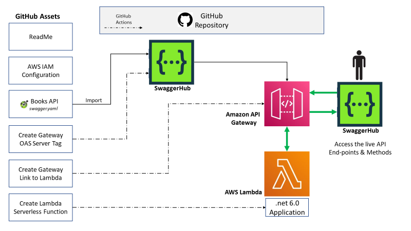
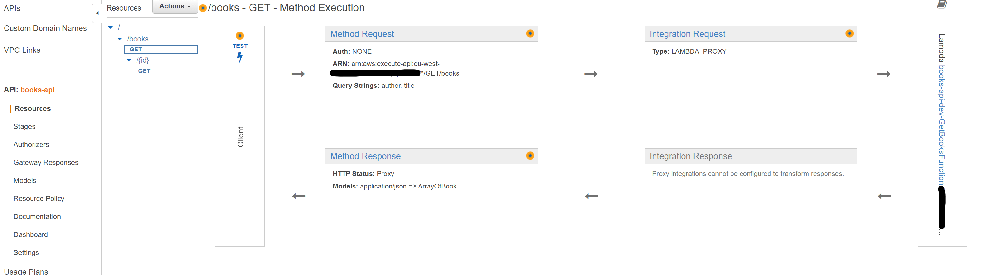
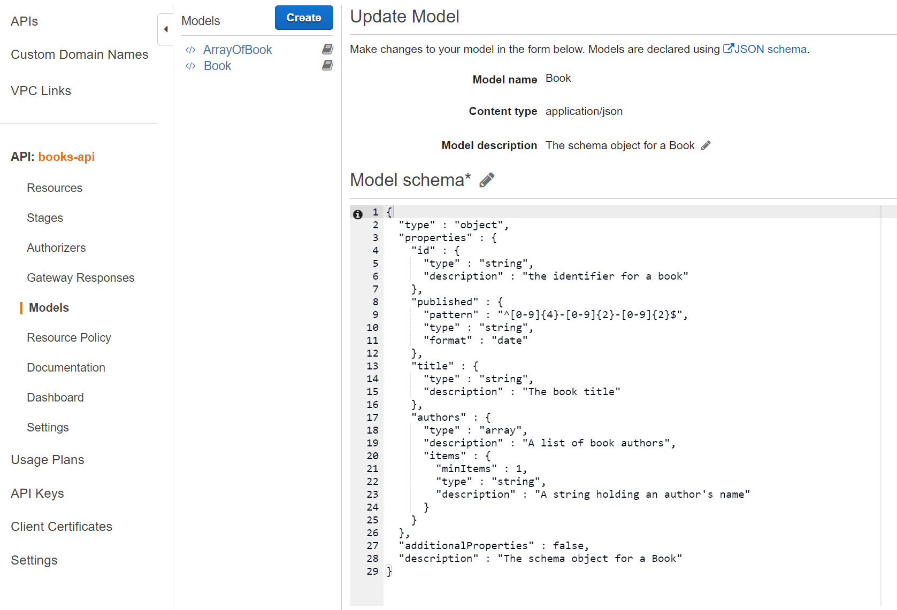
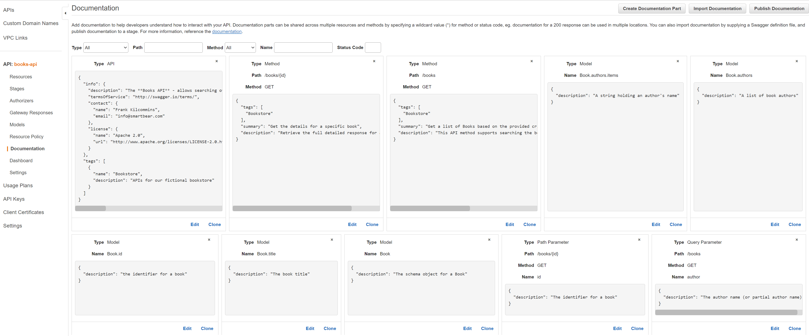
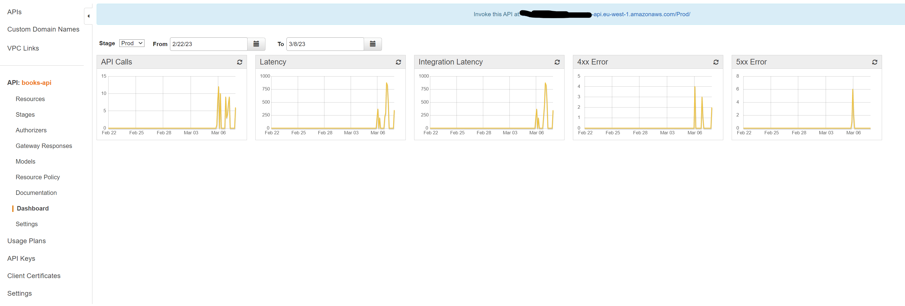

# SwaggerHub-AWSGateway-Lambda

A sample solution taking an API definition from SwaggerHub, crafting a Lambda function from the API definition, and then publishing the function behind AWS Gateway.

## Table of Contents

- [SwaggerHub-AWSGateway-Lambda](#swaggerhub-awsgateway-lambda)
  - [Table of Contents](#table-of-contents)
  - [Problem Statement](#problem-statement)
  - [Solution Overview](#solution-overview)
    - [Scenarios](#scenarios)
      - [Scenario Links](#scenario-links)
      - [High level steps](#high-level-steps)
  - [Prerequisites](#prerequisites)
  - [Instructions](#instructions)
    - [Fork the repo](#fork-the-repo)
    - [Import the _Book API_ into SwaggerHub](#import-the-book-api-into-swaggerhub)
    - [Setup _Auto Mock_ integration in SwaggerHub](#setup-auto-mock-integration-in-swaggerhub)
    - [Test the _Auto Mock_ integration](#test-the-auto-mock-integration)
    - [IAM Role Setup for Deployment to AWS](#iam-role-setup-for-deployment-to-aws)
    - [Deploy _AWS API Gateway_ and _AWS Lambda Function_](#deploy-aws-api-gateway-and-aws-lambda-function)
    - [Update the SwaggerHub Books API with the _AWS API Gateway_ endpoint](#update-the-swaggerhub-books-api-with-the-aws-api-gateway-endpoint)
    - [Calling your _AWS API Gateway_ hosted Books API from SwaggerHub](#calling-your-aws-api-gateway-hosted-books-api-from-swaggerhub)
  - [Review the AWS API Gateway](#review-the-aws-api-gateway)
    - [Resources](#resources)
    - [Models](#models)
    - [Documentation](#documentation)
    - [Usage Dashboards](#usage-dashboards)
  - [Continue the Journey](#continue-the-journey)

## Problem Statement

API design tools and API gateways are two essential components in the development of modern API-based applications. Integrating these tools not only streamlines the API development process but also provides numerous benefits that enhance API functionality, security, and scalability.

SwaggerHub is a multi-spec API design and documentation tool that seamlessly integrates with Amazon Web Services. With this integration, you can establish a relationship between your design/development and your gateway/production environment. Having an integration between the design-time and the run-time allows you to push your API documentation directly from SwaggerHub into your gateway. Every time you update your document in SwaggerHub trigger the required processes to automate the journey towards the API management plane.

Managing your APIs from your gateway becomes a simpler task when you have your API documentation loaded into the tool automatically, there's no need to manually define how your APIs behave when SwaggerHub pushes your API definitions automatically.

By leveraging the seamless integration between SwaggerHub’s API design and documentation capabilities with AWS’s scalable and feature-rich gateway, organizations can confidently deliver innovative, customer-centric services and applications.

## Solution Overview

In this integrated exercise you will create an end-to-end solution which takes you through the process of creating an OpenAPI Specification (OAS) design definition, and deploying the API to an operational AWS environment.

### Scenarios

The `main` branch of this repository contains a simple end-to-end solution.

Alongside supporting webinars/workshops, additional scenarios are stored in separate branches.

1. `vuln-api`
   - This example the process of
     - creating an OpenAPI Specification (OAS) design definition
     - deploying the API to an operational AWS environment.
     - exploring the deployed API to manually identify security vulnerabilities.
2. `vuln-api-hardened`
   - This example follows on the `vuln-api` branch and shows the process of
     - using Spectral public and custom rule-sets to identify vulnerabilities early in the design and development process in
       - SwaggerHub
       - CI
       - Locally
     - rectifying the security vulnerabilities.
     - deploying our updated API to an operational AWS environment.
     - exploring the deployed API to ensure the security vulnerabilities have been resolve

#### Scenario Links

| Content                                                                              | Link                                                                                                                         | Branch Name                                                                                                    | Overview |
| ------------------------------------------------------------------------------------ | ---------------------------------------------------------------------------------------------------------------------------- | -------------------------------------------------------------------------------------------------------------- | -------- |
| How to Streamline API Development on Amazon API Gateway Using SmartBear’s SwaggerHub | [Blog](https://aws.amazon.com/blogs/apn/how-to-streamline-api-development-on-amazon-api-gateway-using-smartbear-swaggerhub/) | [`main`](https://github.com/SmartBear-DevRel/SwaggerHub-AWSGateway-Lambda/tree/main)                           | simple e2e solution         |
| Defend Your APIs - Secure by Design                                                  | [Watch](https://smartbear.com/resources/webinars/defend-your-apis-secure-by-design/?ws=2) / [Slides](https://assets.smartbear.com/transfer/11947ca5400879e80f0d0c90a8a4a94eef42244c4bf57de7b0edcf80e9322a35)                                                                                                                   | [`vuln-api`](https://github.com/SmartBear-DevRel/SwaggerHub-AWSGateway-Lambda/tree/vuln-api)                   | Vulnerable API e2e deployed and explored      |
| Defend Your APIs - Secure by Design                                                  | [Watch](https://smartbear.com/resources/webinars/defend-your-apis-secure-by-design/?ws=2) / [Slides](https://assets.smartbear.com/transfer/11947ca5400879e80f0d0c90a8a4a94eef42244c4bf57de7b0edcf80e9322a35)                                                                                                                      | [`vuln-api-hardened`](https://github.com/SmartBear-DevRel/SwaggerHub-AWSGateway-Lambda/tree/vuln-api-hardened) | Vulnerable API issues identified and rectified               |

#### High level steps

- Import an existing OAS `Books API` definition into SwaggerHub SaaS design & documentation tool
- Enable and test API auto-mocking on the newly imported API in SwaggerHub
- Build, test and deploy the following AWS resources/services:
  - AWS Lambda Serverless Functions (a small backend microservice for the `Books API`)
  - AWS API Gateway (to proxy API traffic to the implemented function)
  - S3 bucket to store the release artifacts
  - IAM roles needed to deploy and run the resources
- Update the SwaggerHub API to include the published AWS API Gateway endpoint
- Call the AWS API Gateway endpoints using SwaggerHub
- Review the AWS API Gateway (the setup of which is driven off the OAS definition)
- Learn about additional steps and functionality supported by the environment that has been setup

The assets and solution overview is as follows:

## Prerequisites

You will need an AWS subscription and a SwaggerHub account in order to be able to work on the API design, AWS Lambda implementation, and automated deployment to AWS API Gateway.

1. Sign up for an [AWS account](https://aws.amazon.com/free/) (if required)
2. Sign up for a [SwaggerHub trial](https://try.smartbear.com/swaggerhub?utm_medium=product&utm_source=GitHub&utm_campaign=devrel-marketplaces-api&utm_content=code-samples) account (if required)
3. Sign up for a [GitHub account](https://github.com/join) (if required)

The sample Lambda function generated within this repo uses `dotnet6`. If you would like to edit the code implementation, then the following are required:

- [VS Code](https://code.visualstudio.com/download) (or similar IDE)
- Install [.NET 6.0](https://dotnet.microsoft.com/en-us/download/dotnet/6.0)
- Install Amazon Lambda Tools
  - `dotnet tool install -g Amazon.Lambda.Tools`
- Install [SAM CLI](https://docs.aws.amazon.com/serverless-application-model/latest/developerguide/install-sam-cli.html) (AWS Serverless Application Model Command Line Interface)

## Instructions

The instructions laid out below cover the following steps:

1. Forking the repository for your local needs
2. Importing the _Book API_ into SwaggerHub
3. Setup _Auto Mock_ integration in SwaggerHub
4. Test the _Auto Mock_ integration
5. IAM Role Setup for Deployment towards AWS
6. Run GitHub Action to deploy _AWS API Gateway_ and _AWS Lambda Function_
7. Update the SwaggerHub Books API with the _AWS API Gateway_ endpoint
8. Calling your _AWS API Gateway_ hosted Books API from SwaggerHub

OK - let's get started!

### Fork the repo

- Fork the repo to your local GitHub profile/organization

### Import the _Book API_ into SwaggerHub

- Login into SwaggerHub
- From the **Create New** menu select **Import and Document API**
- Enter the following URL in the **Path or URL** input box
  - `https://raw.githubusercontent.com/SmartBear-DevRel/SwaggerHub-AWSGateway-Lambda/main/API-Definition/openapi.yaml`
- Press the **Import** button
- In the next pop-up window click the **Import Definition** button

### Setup _Auto Mock_ integration in SwaggerHub

- In the SwaggerHub Portal page, click on the `Books API`
- In the left pane, click on the API name `books-api`
- Click on the **Integrations** tab
- Click on **Add New Integrations**
- In the Integrations dropdown, select **API Auto Mocking** and click the **ADD** button
- In the Name text box, enter `Auto Mocking`
- Click the **CREATE AND EXECUTE** button
- Click on the **DONE** button
- Click on the API name `book-api` again to return to the editor view

> Note that a new description and url tags have been added in the servers section of the API

### Test the _Auto Mock_ integration

- In the right panel, in the **Servers** dropdown, select the **SwaggerHub API Auto Mocking** server URL
- Open any of the Method/Path end-points (e.g. `GET /books`) and click the **Try it out** button
- Provide any `required` parameters
- Click the **Execute** button
- Review the data returned in the Server response box

> In the next steps, we'll deploy a working version of the `books-api` to AWS API Gateway and have a functioning Lambda function as the API implementation. Once deployed, we'll call the implemented API from SwaggerHub!

### IAM Role Setup for Deployment to AWS

- Follow the [IAM and Resource Setup Guide](./IAM_DEPLOYMENT_ROLES.md) to ensure you can run the pipeline

### Deploy _AWS API Gateway_ and _AWS Lambda Function_

- In your forked GitHub repository, navigate to the _Actions_ tab
- Click on the `Pipeline` action on the left-hand pane
- Run the `Pipeline` workflow by clicking on the **Run workflow** button
- Once the pipeline has completed, navigate to the bottom of the pipeline summary and locate the **output-endpoint summary** section
- Copy the **AWS_API_Gateway_Endpoint** URL

> We'll need the API endpoint above to call the API, so keep it to hand!

### Update the SwaggerHub Books API with the _AWS API Gateway_ endpoint

- In the SwaggerHub Portal page, click on `Books API` to open the API definition
- Locate the `servers` tag, and replace the `url` for the `AWS API Gateway Endpoint` server tag (currently holding a value of `https://example.com`) with the value of the URL value copied from the pipeline summary above
- Click the **Save** button

### Calling your _AWS API Gateway_ hosted Books API from SwaggerHub

- In the SwaggerHub Portal page, click on `Books API` to open the API definition
- In the _SwaggerUI_ pane (the right-hand pane), choose the _AWS API Gateway Endpoint_ from the **Servers** dropdown
- Expand `GET /books`, click the **Try it out** button
- Optionally, enter an `title` or `author` query parameter
- Click **Execute**

## Review the AWS API Gateway

The [Books API](./API-Definition/openapi.yaml) OpenAPI definition and the [SAM Template](./books-api/template.yaml) combined drive much of the setup of the AWS API Gateway and linked Lambda Functions. The benefit of this is that the gateway will get automatically hydrated based on the design definitions.

Let's take a quick look

### Resources

The API resources automatically configured in the gateway conform to the API definition (e.g. `GET /books` and `GET /books/{id}`).

### Models

The API models are automatically generated from the JSON Schema components contained in the API definition.

### Documentation

The API documentation is also generated from the API definition negating the need for documentation to be added after publishing to the gateway.

### Usage Dashboards

One of the major benefits of a gateway function is being able to observe how an API is being consumed. AWS API Gateway gives plenty of insights on API calls and performance out of the box.

## Continue the Journey

- Using [SwaggerHub Explore](https://try.smartbear.com/swaggerhub-explore?utm_medium=thirdPart&utm_source=devrel-content&utm_campaign=devrel-explore&utm_content=blog) to interact with the surface area of an API
- Using the [SwaggerHub CLI](https://github.com/SmartBear/swaggerhub-cli) (Command Line Interface)
- Adding [custom standardization](https://support.smartbear.com/swaggerhub/docs/organizations/api-standardization.html) rules and guidelines to SwaggerHub
- Using [SwaggerHub domains](https://support.smartbear.com/swaggerhub/docs/domains/index.html) (shared code libraries) to share common API components across multiple APIs
- Adding [authentication](https://swagger.io/docs/specification/authentication/) to the sample API and AWS Gateway
